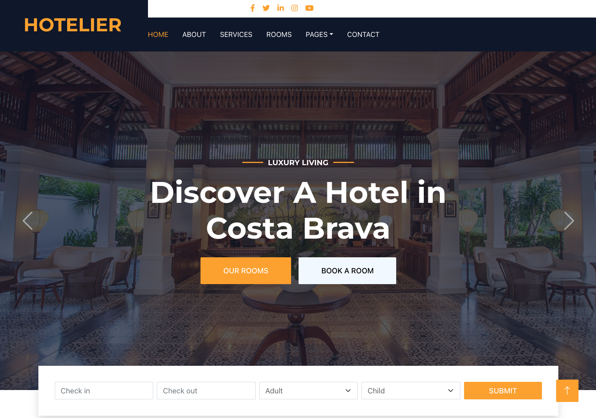

# Build Intelligent apps: Semantic Kernel in your application

In this repository we'll show you how to leverage [Semantic Kernel](https://github.com/microsoft/semantic-kernel) into an existing application. As an example we'll use how you can benefit from Semantic Kernel in a Hotel booking website. You can use natural language to search through a list of hotels.

This demostration was shown on following events:

- [Austria] Oct/23 - [Microsoft Build 2023](https://pulse.microsoft.com/de-at/transform-de-at/na/fa2-microsoft-build-austria/)
- [Ireland] Oct/23 - [Microsoft Build 2023](https://msevents.microsoft.com/event?id=3755029226)
- [Belgium] Nov/23 - [SaaS local day](https://msevents.microsoft.com/event?id=1131853098)
- [Austria] Dec/23 - [Unlocking AI Opportunities:](https://msevents.microsoft.com/event?id=1236497086)

## Why Semantic Kernel?

[Semantic Kernel](https://github.com/microsoft/semantic-kernel) allows developers to use AI without any knowledge about AI or LLM. As a web developer or software engineer you can focus on the things you're best: writing code for business applications, and you have the LLM or other models completely abstracted.

## What is in this example?

This example has two parts:

1. an `ui` part which contains the Hotel booking website written in React.
2. an `api` part which contains the Hotel booking API written in Python and contains some custom logic and the Semantic Kernel SDK.
